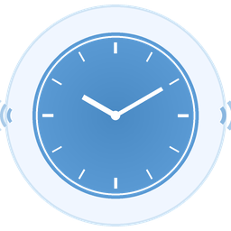

# 报时宝 BaoShiBao

A macOS desktop alarm clock that speaks the current time in Mandarin Chinese — using **your own cloned voice** or the system TTS voice.



## Features

- **Voice Cloning** — Upload or record a short voice sample (~10-12 seconds), and the app clones your voice to announce the time using [F5-TTS](https://github.com/SWivid/F5-TTS)
- **In-App Recording** — Record your voice directly in the app with guided Chinese scripts, countdown timer, and live mic level indicator
- **Continuous Alarm** — Once triggered, keeps speaking the current time with a configurable gap (1s, 2s, 5s...) until you press Stop
- **Voice Library** — Save, rename, switch between multiple voice profiles. Click a name to rename it
- **Clean UI** — Minimal design inspired by [小宇宙](https://www.xiaoyuzhoufm.com/) podcast app, with a light blue theme
- **macOS Native** — Bundles as a `.app` you can double-click, with a custom icon

## Screenshots

| Main App | Recording Dialog |
|----------|-----------------|
| Clock circle, settings, voice library, Start/Stop/Test buttons | Guided script, record button, countdown, Play/Use/Save options |

## Requirements

- **macOS** (uses `say` command and `afplay` for audio)
- **Python 3.10+** (tested with miniforge/conda)
- **customtkinter** — modern tkinter UI

### For voice cloning (optional):
- **f5-tts** — voice cloning engine
- **ffmpeg** — audio format conversion
- **sounddevice** — in-app microphone recording

## Installation

```bash
# Clone the repo
git clone https://github.com/boqianli1202/BaoShiBao.git
cd BaoShiBao

# Install dependencies
pip install customtkinter

# Optional: enable voice cloning
pip install f5-tts sounddevice
conda install -c conda-forge ffmpeg

# Run
python3 clock.py
```

## Build macOS App Bundle

```bash
# Generate the icon
python3 generate_icon.py

# Create .app bundle
APP="报时宝 BaoShiBao.app"
mkdir -p "$APP/Contents/MacOS" "$APP/Contents/Resources"
cp AppIcon.icns "$APP/Contents/Resources/"

# Create Info.plist and launcher script (see repo files)
# Then sign it:
chmod +x "$APP/Contents/MacOS/launcher"
xattr -cr "$APP"
codesign --force --deep --sign - "$APP"
```

## Voice Cloning Tips

For best results when recording your voice:

1. **Quiet room** — no background noise (most important factor)
2. **10-12 seconds** — don't go over 15 seconds
3. **Calm, clear, moderate pace** — the model copies your exact style
4. **Leave 1 second of silence** at the end
5. **Type the exact transcript** when prompted

### Recommended recording scripts:

> 今天天气很好，现在是北京时间下午三点二十五分，请注意安排好您的时间。

> 每天早上八点钟，我都会准时起床，然后喝一杯热茶，开始新的一天。

> 各位同学请注意，现在距离考试结束还有四十五分钟，请抓紧时间完成答卷。

## How It Works

1. **Set alarm time** and gap interval
2. **Upload or record** a voice sample for cloning
3. Press **Start** — waits for alarm time
4. When alarm triggers: speaks the current time in Chinese, continuously with the set gap
5. Press **Stop** to silence

Without voice cloning, falls back to macOS built-in **Tingting** (婷婷) Mandarin TTS voice.

## Tech Stack

- **Python 3** + **customtkinter** — GUI framework
- **F5-TTS** (XTTS-v2) — zero-shot voice cloning from short audio samples
- **sounddevice** + **soundfile** — microphone recording at 24kHz
- **macOS `say`** — system TTS fallback (Tingting voice)
- **macOS `afplay`** — audio playback

## License

MIT
